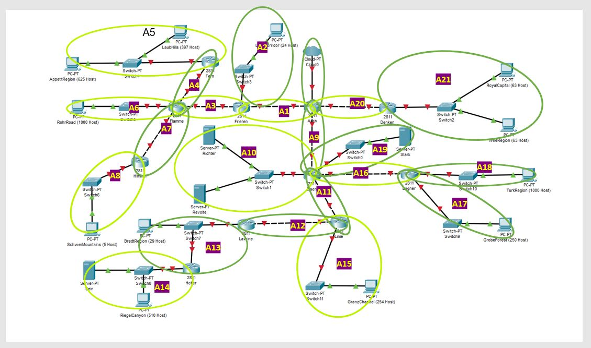
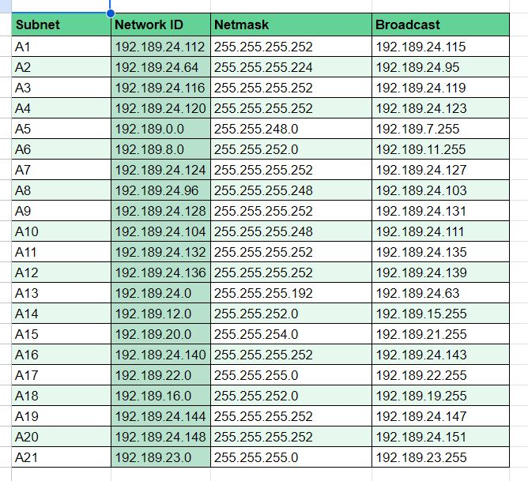

# Jarkom-Modul-4-B22-2023



## GNS3


### VLSM

Untuk VLSM, pembagian subnet dilakukan sesuai jumlah alamat IP yang dibutuhkan.

Berikut jumlah subnet berdasarkan subnet mask :
```
/30	10
/29	2
/28	0
/27	1
/26	1
/25	0
/24	2
/23	1
/22	3
/21	1
/20	0
```

Maka, berdasarkan jumlah tersebut, dibagi ip dimulai dari `192.189.0.0` :


Subnet hasil pembagian lalu dibagi sesuai kebutuhan (tidak urut kode subnet)



### Interface

Subnet yang sudah dibagi digunakan dalam penulisan interface dengan cara

1. Dari Aura ke client/server (leaf node), beri interface router yang dekat dengan Aura ip subnet + 1.
2. Jika ada interface yang butuh 1 ip, beri terlebih dahulu untuk ip selanjutnya.
3. Terakhir, jika ada beri ip untuk node client yang melambangkan banyak client.

Hasil untuk GNS3 adalah sebagai berikut :

#### A1 - A3Frieren - A9Aura, A20 - A21

- Aura
```
auto eth0
iface eth0 inet dhcp

auto eth1
iface eth1 inet static
	address 192.189.24.113
	netmask 255.255.255.252

auto eth2
iface eth2 inet static
	address 192.189.24.129
	netmask 255.255.255.252

auto eth3
iface eth3 inet static
	address 192.189.24.149
	netmask 255.255.255.252
```
- Frieren
```
auto eth0
iface eth0 inet static
	address 192.189.24.114
	netmask 255.255.255.252

auto eth1
iface eth1 inet static
	address 192.189.24.65
	netmask 255.255.255.224

auto eth2
iface eth2 inet static
	address 192.189.24.117
	netmask 255.255.255.252
```
- LakeKorridor
```
auto eth0
iface eth0 inet static
	address 192.189.24.66
	netmask 255.255.255.224
```
- Denken
```
auto eth0
iface eth0 inet static
	address 192.189.24.150
	netmask 255.255.255.252

auto eth1
iface eth1 inet static
	address 192.189.23.1
	netmask 255.255.255.0
```
- RoyalCapital
```
auto eth0
iface eth0 inet static
	address 192.189.23.2
	netmask 255.255.255.0
```
- WilleRegion
```
auto eth0
iface eth0 inet static
	address 192.189.23.65
	netmask 255.255.255.0
```
#### A3Flamme - A8
- Flamme
```
auto eth0
iface eth0 inet static
	address 192.189.24.118
	netmask 255.255.255.252
auto eth1
iface eth1 inet static
	address 192.189.24.121
	netmask 255.255.255.252
auto eth2
iface eth2 inet static
	address 192.189.8.1
	netmask 255.255.252.0
auto eth3
iface eth3 inet static
	address 192.189.24.125
	netmask 255.255.255.252
```
- Fern
```
auto eth0
iface eth0 inet static
	address 192.189.24.122
	netmask 255.255.255.252
auto eth1
iface eth1 inet static
	address 192.189.0.1
	netmask 255.255.248.0
```
- LaubHills
```
auto eth0
iface eth0 inet static
	address 192.189.0.2
	netmask 255.255.248.0
```
- AppetitRegion
```
auto eth0
iface eth0 inet static
	address 192.189.1.143
	netmask 255.255.248.0
```
- RohrRoad
```
auto eth0
iface eth0 inet static
	address 192.189.8.2
	netmask 255.255.252.0
```
- Himmel
```
auto eth0
iface eth0 inet static
	address 192.189.24.126
	netmask 255.255.255.252
auto eth1
iface eth1 inet static
	address 192.189.24.97
	netmask 255.255.255.248
```
- SchwerMountains
```
auto eth0
iface eth0 inet static
	address 192.189.24.98
	netmask 255.255.255.248
```
#### A9Eisen - A11Eisen, A16 - A19

- Eisen
```
auto eth0
iface eth0 inet static
	address 192.189.24.130
	netmask 255.255.255.252
auto eth1
iface eth1 inet static
	address 192.189.24.105
	netmask 255.255.255.248
auto eth2
iface eth2 inet static
	address 192.189.24.133
	netmask 255.255.255.252
auto eth3
iface eth3 inet static
	address 192.189.24.141
	netmask 255.255.255.252
auto eth4
iface eth4 inet static
	address 192.189.24.145
	netmask 255.255.255.252
```
- Richter
```
auto eth0
iface eth0 inet static
	address 192.189.24.106
	netmask 255.255.255.248
```
- Revolte
```
auto eth0
iface eth0 inet static
	address 192.189.24.107
	netmask 255.255.255.248
```
- Stark
```
auto eth0
iface eth0 inet static
	address 192.189.24.146
	netmask 255.255.255.252
```
- Lugner
```
auto eth0
iface eth0 inet static
	address 192.189.24.142
	netmask 255.255.255.252
auto eth1
iface eth1 inet static
	address 192.189.22.1
	netmask 255.255.255.0
auto eth2
iface eth2 inet static
	address 192.189.16.1
	netmask 255.255.252.0
```
- GrobeForest
```
auto eth0
iface eth0 inet static
	address 192.189.22.2
	netmask 255.255.255.0
```
- TurkRegion
```
auto eth0
iface eth0 inet static
	address 192.189.16.2
	netmask 255.255.252.0
```
#### A11Linie - A15

- Linie
```
auto eth0
iface eth0 inet static
	address 192.189.24.134
	netmask 255.255.255.252
auto eth1
iface eth1 inet static
	address 192.189.24.137
	netmask 255.255.255.252
auto eth2
iface eth2 inet static
	address 192.189.20.1
	netmask 255.255.254.0
```
- GranzChannel
```
auto eth0
iface eth0 inet static
	address 192.189.20.2
	netmask 255.255.254.0
```
- Lawine
```
auto eth0
iface eth0 inet static
	address 192.189.24.138
	netmask 255.255.255.252
auto eth1
iface eth1 inet static
	address 192.189.24.1
	netmask 255.255.255.192
```
- BredtRegion
```
auto eth0
iface eth0 inet static
	address 192.189.24.3
	netmask 255.255.255.192
```
- Heiter
```
auto eth0
iface eth0 inet static
	address 192.189.24.2
	netmask 255.255.255.192
auto eth1
iface eth1 inet static
	address 192.189.12.1
	netmask 255.255.252.0
```
- Sein
```
auto eth0
iface eth0 inet static
	address 192.189.12.2
	netmask 255.255.252.0
```
- RiegelCanyon
```
auto eth0
iface eth0 inet static
	address 192.189.12.3
	netmask 255.255.252.0
```

### Routing

Dilakukan routing dimulai dari Aura dengan seolah2 graph berupa tree yang memiliki root Aura. Langkah yang dilakukan :
1. Selain Aura, tulis routing dengan ip dan netmask 0.0.0.0 untuk semua paket yang menuju subnet selain yang di bawahnya (subtreenya).
2. Tulis routing untuk semua subnet di bawahnya (subtreenya) namun tidak langsung terhubung dengan router tersebut.

Untuk client & server, tambahkan routing dengan ip dan netmask 0.0.0.0 dan gateway interface router yang terhubung dengan client/server tersebut.

#### Isi /root/.bashrc setiap node

```
echo "cd /root
bash /root/route.sh" >> /root/.bashrc
nano /root/route.sh

```

**Berikut isi setiap /root/route.sh**

#### ROUTERS

##### Aura


```
route add -net 192.189.24.64 netmask 255.255.255.224 gw 192.189.24.114 #A2	
route add -net 192.189.24.116 netmask 255.255.255.252 gw 192.189.24.114 #A3	
route add -net 192.189.24.120 netmask 255.255.255.252 gw 192.189.24.114 #A4	
route add -net 192.189.0.0 netmask 255.255.248.0 gw 192.189.24.114 #A5	
route add -net 192.189.8.0 netmask 255.255.252.0 gw 192.189.24.114 #A6	
route add -net 192.189.24.124 netmask 255.255.255.252 gw 192.189.24.114 #A7	
route add -net 192.189.24.96 netmask 255.255.255.248 gw 192.189.24.114 #A8	
route add -net 192.189.24.104 netmask 255.255.255.248 gw 192.189.24.130 #A10	
route add -net 192.189.24.132 netmask 255.255.255.252 gw 192.189.24.130 #A11	
route add -net 192.189.24.136 netmask 255.255.255.252 gw 192.189.24.130 #A12	
route add -net 192.189.24.0 netmask 255.255.255.192 gw 192.189.24.130 #A13	
route add -net 192.189.12.0 netmask 255.255.252.0 gw 192.189.24.130 #A14	
route add -net 192.189.20.0 netmask 255.255.254.0 gw 192.189.24.130 #A15	
route add -net 192.189.24.140 netmask 255.255.255.252 gw 192.189.24.130 #A16	
route add -net 192.189.22.0 netmask 255.255.255.0 gw 192.189.24.130 #A17	
route add -net 192.189.16.0 netmask 255.255.252.0 gw 192.189.24.130 #A18	
route add -net 192.189.24.144 netmask 255.255.255.252 gw 192.189.24.130 #A19	
route add -net 192.189.23.0 netmask 255.255.255.0 gw 192.189.24.150 #A21

```

##### Denken 

```
route add -net 0.0.0.0 netmask 0.0.0.0 gw 192.189.24.149 #A21
```

##### Frieren


```
route add -net 0.0.0.0 netmask 0.0.0.0 gw 192.189.24.113
route add -net 192.189.24.120 netmask 255.255.255.252 gw 192.189.24.118 #A4	
route add -net 192.189.0.0 netmask 255.255.248.0 gw 192.189.24.118 #A5	
route add -net 192.189.8.0 netmask 255.255.252.0 gw 192.189.24.118 #A6	
route add -net 192.189.24.124 netmask 255.255.255.252 gw 192.189.24.118 #A7	
route add -net 192.189.24.96 netmask 255.255.255.248 gw 192.189.24.118 #A8	

```

##### Fern

```
route add -net 0.0.0.0 netmask 0.0.0.0 gw 192.189.24.121 #A6
```
##### Flamme
```
route add -net 0.0.0.0 netmask 0.0.0.0 gw 192.189.24.117
route add -net 192.189.0.0 netmask 255.255.248.0 gw 192.189.24.122 #A5	
route add -net 192.189.24.96 netmask 255.255.255.248 gw 192.189.24.126 #A8	

```
##### Himmel

```
route add -net 0.0.0.0 netmask 0.0.0.0 gw 192.189.24.125 #A9
```

---

##### Eisen
```
route add -net 0.0.0.0 netmask 0.0.0.0 gw 192.189.24.129	
route add -net 192.189.24.136 netmask 255.255.255.252 gw 192.189.24.134 #A12	
route add -net 192.189.24.0 netmask 255.255.255.192 gw 192.189.24.134 #A13	
route add -net 192.189.12.0 netmask 255.255.252.0 gw 192.189.24.134 #A14	
route add -net 192.189.20.0 netmask 255.255.254.0 gw 192.189.24.134 #A15	
route add -net 192.189.22.0 netmask 255.255.255.0 gw 192.189.24.142 #A17	
route add -net 192.189.16.0 netmask 255.255.252.0 gw 192.189.24.142 #A18	

```
##### Lugner
```
route add -net 0.0.0.0 netmask 0.0.0.0 gw 192.189.24.141	
``` 


---


##### Linie
```
route add -net 0.0.0.0 netmask 0.0.0.0 gw 192.189.24.133
route add -net 192.189.24.0 netmask 255.255.255.192 gw 192.189.24.138 #A13	
route add -net 192.189.12.0 netmask 255.255.252.0 gw 192.189.24.138 #A14		
``` 
##### Lawine
```
route add -net 0.0.0.0 netmask 0.0.0.0 gw 192.189.24.137	
route add -net 192.189.12.0 netmask 255.255.252.0 gw 192.189.24.2 #A14	
``` 
##### Heiter
```
route add -net 0.0.0.0 netmask 0.0.0.0 gw 192.189.24.1	
``` 

----


#### END DEVICES


##### RoyalCapital & WilleRegion

```
route add -net 0.0.0.0 netmask 0.0.0.0 gw 192.189.23.1 #A22
```

##### LakeKorridor

```
route add -net 0.0.0.0 netmask 0.0.0.0 gw 192.189.24.65 #A3
```

##### LaubHills & AppetitRegion
```
route add -net 0.0.0.0 netmask 0.0.0.0 gw 192.189.0.1	
``` 

##### RohrRoad
```
route add -net 0.0.0.0 netmask 0.0.0.0 gw 192.189.8.1	
``` 

##### SchwerMountains
```
route add -net 0.0.0.0 netmask 0.0.0.0 gw 192.189.24.97	
``` 

---
##### Richter & Revolte
```
route add -net 0.0.0.0 netmask 0.0.0.0 gw 192.189.24.105	
``` 
##### GrobeForest
```
route add -net 0.0.0.0 netmask 0.0.0.0 gw 192.189.22.1	
``` 
##### TurkRegion
```
route add -net 0.0.0.0 netmask 0.0.0.0 gw 192.189.16.1	
``` 
##### Stark
```
route add -net 0.0.0.0 netmask 0.0.0.0 gw 192.189.24.145	
``` 

---

##### BredtRegion
```
route add -net 0.0.0.0 netmask 0.0.0.0 gw 192.189.24.1	
``` 
##### Sein & RiegelCanyon
```
route add -net 0.0.0.0 netmask 0.0.0.0 gw 192.189.12.1	
``` 
##### GranzChannel
```
route add -net 0.0.0.0 netmask 0.0.0.0 gw 192.189.20.1	
``` 

----
----
#### Tes untuk memastikan routing aman : Melakukan ping (paket 2 arah) ke semua end device dari router "Aura"

```
ping 192.189.24.66 #LakeKorridor
ping 192.189.23.2 #RoyalCapital
ping 192.189.23.65 #WilleRegion
LaubHills
ping 192.189.0.2
AppetitRegion
ping 192.189.1.143
RohrRoad
ping 192.189.8.2
SchwerMountains
ping 192.189.24.98
Richter
ping 192.189.24.106
Revolte
ping 192.189.24.107
Stark
ping 192.189.24.146
GrobeForest
ping 192.189.22.2
TurkRegion
ping 192.189.16.2
GranzChannel
ping 192.189.20.2
BredtRegion
ping 192.189.24.3
Sein
ping 192.189.12.2
RiegelCanyon
ping 192.189.12.3

```

Berikut foto dari hasil tes di atas


 
  
   
    
     
      
       
